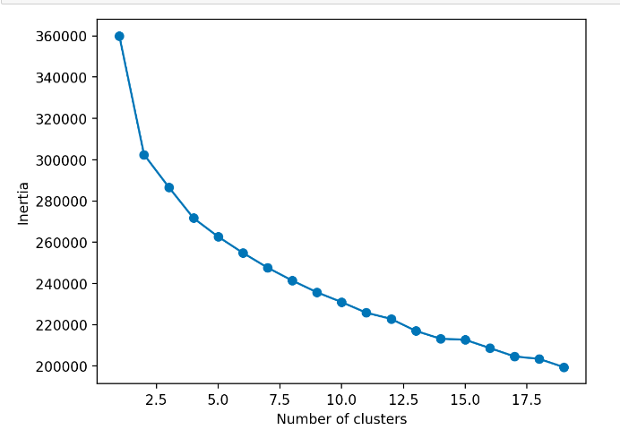
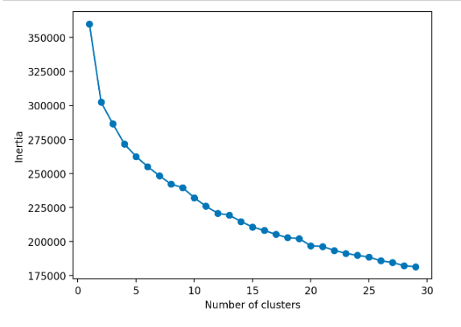
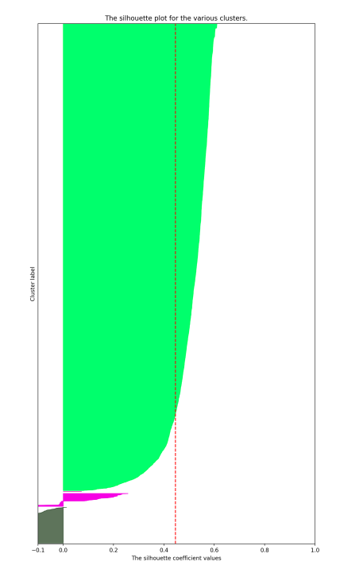
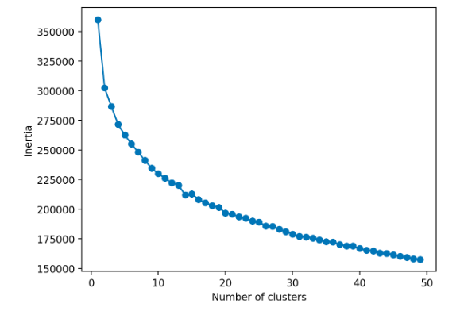
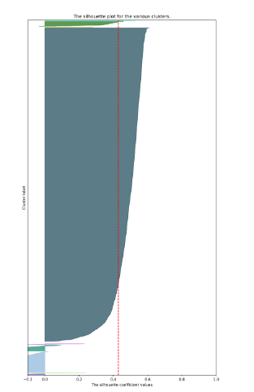
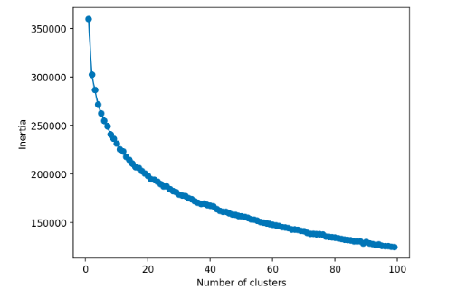

<h1> 10 Clusters and Silhoutte </h1>

I used silhoutte method for 2 clusters based on the image above, it appeared as though there was a slight elbow at 2 clusters. But I don't think that two clusters with a data set this large will be helpful. 

<h1> 20 Clusters  </h1>

Seeing the same amount of clusters here, I did not not continue with the silhoutte method because again I thought 2 clusters were too litte. 

<h1> 30 Clusters and Silhoutte </h1>

<h1> 50 Clusters and Silhoutte </h1>

At this point I am feeling good about 15 clusters as the product descriptions are grouping together logically. 

<h1> 100 Clusters and Silhoutte </h1>

