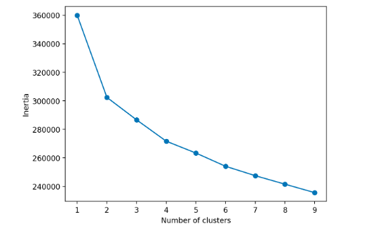
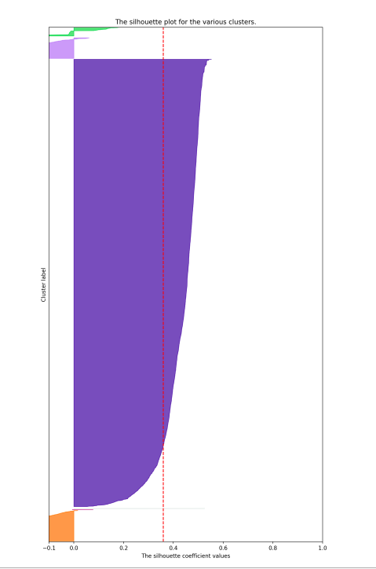

10 Clusters and Silhoutte

I used silhoutte method for 2 clusters based on the image above, it appeared as though there was a slight elbow at 2 clusters. But I don't think that two clusters with a data set this large will be helpful. 

